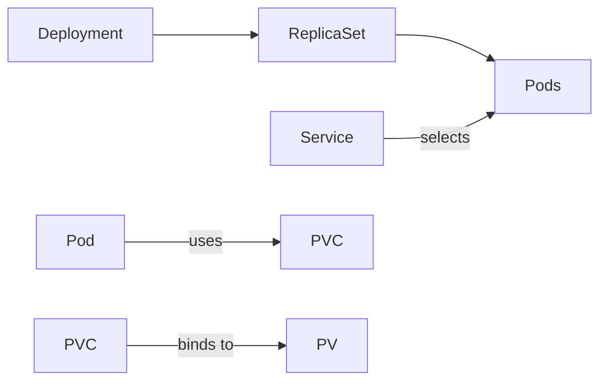

### **Docker Compose: A Beginner's Guide with Node.js Demos**  
*(No prior Docker knowledge needed!)*

---

#### **1. What is Docker Compose?**  
- **Docker** packages apps + dependencies into isolated containers.  
- **Docker Compose** manages **multi-container apps** using a single YAML file (`docker-compose.yml`).  
- **Key Benefit**: Define complex setups (web server, database, cache) in one file → spin up/down with one command.

---

#### **2. Core Concepts Simplified**  
| Term          | Explanation                                                                 | Example in Node.js App          |
|---------------|-----------------------------------------------------------------------------|---------------------------------|
| **Service**   | A container running one part of your app (e.g., Node.js server, Redis).    | `web`, `redis`, `db`            |
| **Volume**    | Persistent storage that survives container restarts.                       | Database files, uploaded images |
| **Network**   | Containers in the same Compose file auto-connect & communicate by name.    | `web` talks to `redis` via hostname `redis` |
| **Image**     | Blueprint for a container (e.g., `node:18-alpine`, `redis:7`).             | Built from Dockerfile or pulled from Docker Hub |

---

#### **3. Install Docker & Compose**  
- **Windows/Mac**: Install [Docker Desktop](https://www.docker.com/products/docker-desktop/) (includes Compose).  
- **Linux**:  
  ```bash
  sudo apt-get update
  sudo apt-get install docker.io docker-compose
  sudo usermod -aG docker $USER && newgrp docker  # Grant permissions
  ```
- **Verify**:  
  ```bash
  docker --version     # Docker version 20.10.23+
  docker-compose --version  # v2.17.2+
  ```

---

#### **4. Demo 1: Basic Node.js App (No Database)**  
*Goal: Run a Node.js web server in a container.*  

**Step 1: Project Setup**  
```bash
mkdir node-app && cd node-app
npm init -y
npm install express
```

**File: `app.js`**  
```javascript
const express = require('express');
const app = express();
const PORT = 3000;

app.get('/', (req, res) => {
  res.send('Hello from Docker Compose!');
});

app.listen(PORT, () => {
  console.log(`Server running on port ${PORT}`);
});
```

**File: `Dockerfile`**  
```dockerfile
# Use lightweight Node.js image
FROM node:18-alpine

# Set working directory
WORKDIR /app

# Copy package.json first (for caching)
COPY package*.json ./

# Install dependencies
RUN npm install

# Copy app code
COPY . .

# Expose port
EXPOSE 3000

# Start the app
CMD ["node", "app.js"]
```

**File: `docker-compose.yml`**  
```yaml
version: '3.8'  # Compose file format version

services:
  web:  # Service name
    build: .    # Build from Dockerfile in current directory
    ports:
      - "3000:3000"  # HOST_PORT:CONTAINER_PORT
    volumes:
      - .:/app     # Mount current directory into container (for live reload)
    environment:
      NODE_ENV: development
```

**Run It!**  
```bash
docker-compose up --build  # Build images and start containers
```
- Visit `http://localhost:3000` → See "Hello from Docker Compose!"  
- **Stop**: Press `Ctrl+C` in the terminal.  
- **Clean up**:  
  ```bash
  docker-compose down  # Stop and remove containers
  ```

---

#### **5. Demo 2: Node.js + Redis**  
*Goal: Add a Redis cache to count page visits.*  

**Update `app.js`**  
```javascript
const redis = require('redis');
const client = redis.createClient({
  host: 'redis',  // Service name from docker-compose.yml
  port: 6379
});

app.get('/', (req, res) => {
  client.incr('visits', (err, count) => {
    res.send(`Visits: ${count}`);
  });
});
```

**Install Redis Client**  
```bash
npm install redis
```

**Update `docker-compose.yml`**  
```yaml
version: '3.8'

services:
  web:
    build: .
    ports:
      - "3000:3000"
    volumes:
      - .:/app
    depends_on:  # Start Redis before web
      - redis
    environment:
      NODE_ENV: development

  redis:  # Redis service
    image: "redis:7-alpine"  # Official Redis image
    volumes:
      - redis-data:/data  # Persistent volume

volumes:  # Define named volumes
  redis-data:  # Data survives "docker-compose down"
```

**Run It!**  
```bash
docker-compose up --build
```
- Visit `http://localhost:3000` → Refresh to see visit count increase.  
- **Test Persistence**:  
  ```bash
  docker-compose down  # Stop containers (volume persists)
  docker-compose up -d # Restart in background
  ```
  Visit the page again → Count resumes from last value!

---

#### **6. Key Commands Cheat Sheet**  
| Command                          | Description                                  |
|----------------------------------|----------------------------------------------|
| `docker-compose up`              | Start services (in foreground)               |
| `docker-compose up -d`           | Start in background (detached mode)          |
| `docker-compose down`            | Stop + remove containers, networks, volumes |
| `docker-compose down -v`         | Remove volumes too (delete persistent data) |
| `docker-compose build`           | Rebuild images                               |
| `docker-compose logs -f web`     | Stream logs from "web" service               |
| `docker-compose exec web sh`     | Open shell inside "web" container            |

---

#### **7. Why Use Docker Compose?**  
- **Reproducibility**: "Works on my machine" → "Works everywhere".  
- **Isolation**: Dependencies (Node.js version, Redis) won’t conflict with your host OS.  
- **Scaling**: Add more services (database, cache, queue) without complex setup.  
- **Dev/Prod Parity**: Same config works in development, testing, and production.  

---

#### **8. Pro Tips for Beginners**  
1. **.dockerignore**:  
   Create `.dockerignore` to exclude `node_modules`, `.git`, etc.:  
   ```
   node_modules
   .git
   .env
   ```

2. **Environment Variables**:  
   Use `.env` file to manage secrets/config:  
   ```env
   # .env
   REDIS_HOST=redis
   PORT=3000
   ```
   Reference in `docker-compose.yml`:  
   ```yaml
   environment:
     - REDIS_HOST=${REDIS_HOST}
   ```

3. **Live Reload (Dev Mode)**:  
   Use `nodemon` to restart Node.js on code changes:  
   ```dockerfile
   # Dockerfile (dev version)
   RUN npm install -g nodemon
   CMD ["nodemon", "app.js"]
   ```

4. **Health Checks**:  
   Ensure services start in order (e.g., wait for Redis to be ready):  
   ```yaml
   redis:
     image: redis
     healthcheck:
       test: ["CMD", "redis-cli", "ping"]
       interval: 1s
   web:
     depends_on:
       redis:
         condition: service_healthy
   ```

---

#### **9. Next Steps**  
- **Explore Official Images**: Search [Docker Hub](https://hub.docker.com) for pre-built images (PostgreSQL, MongoDB, Nginx).  
- **Advanced Networking**: Create multiple networks for security (e.g., isolate database from public access).  
- **Multi-Stage Builds**: Optimize Node.js image size:  
  ```dockerfile
  FROM node:18 as builder
  WORKDIR /app
  COPY package*.json ./
  RUN npm install
  COPY . .
  RUN npm run build

  FROM node:18-alpine
  COPY --from=builder /app/dist ./dist
  COPY package*.json ./
  RUN npm install --production
  CMD ["node", "dist/app.js"]
  ```

---

**Final Thought**: Docker Compose eliminates "works on my machine" hell. Start small (one service), then add databases/caches as needed. You’ve got this! 🐳✨  

> **Troubleshooting Tip**: If ports are in use, change host port mapping:  
> ```yaml
> ports:
>   - "8000:3000"  # Access at http://localhost:8000
> ```

### **Deploying Docker Compose to Azure Container Instances (ACI)**  
*For beginners: From local Compose to cloud deployment in 15 minutes*  

---

#### **1. Why ACI? Key Concepts**  
| **Local Docker Compose**          | **Azure Container Instances (ACI)**          |
|-----------------------------------|-----------------------------------------------|
| Runs on your machine              | Serverless containers in Azure cloud          |
| Free (uses your resources)        | Pay-per-second billing                        |
| Limited to your machine's power   | Scale CPU/memory on-demand                    |
| No built-in HA/backups            | 99.9% SLA, automatic recovery                 |
| Manual port forwarding            | Public IP + FQDN auto-provisioned             |
| **Best for**: Development/testing | **Best for**: Simple production workloads, burst scenarios, task automation |

⚠️ **Critical Limitations**:  
- **No persistent volumes** (data lost on container restart)  
- **No direct database deployments** (use Azure DB services instead)  
- **No private networking** (containers get public IPs by default)  

> 💡 **Use Case Fit**: Ideal for stateless apps (APIs, web frontends, batch jobs).  
> ❌ **Avoid**: Databases, stateful services, complex microservices (use AKS instead).

---

#### **2. Prerequisites**  
1. **Azure Account**  
   - [Free $200 credit](https://azure.microsoft.com/free/) (new accounts)  
2. **Tools Installed**:  
   ```bash
   # Azure CLI (command-line interface)
   curl -sL https://aka.ms/InstallAzureCLIDeb | sudo bash

   # Docker Compose v2+ (built into Docker Desktop)
   docker compose version  # Must show "v2.x.x"
   ```
3. **Local Project**:  
   Use the [Node.js + Redis demo from Part 1](#) but **remove Redis** (ACI limitations). We'll use a simple stateless app.

---

#### **3. Step-by-Step Deployment**  

##### **A. Prepare Your App**  
*File: `app.js` (stateless version)*  
```javascript
const express = require('express');
const app = express();
const PORT = process.env.PORT || 3000; // Critical for ACI

app.get('/', (req, res) => {
  res.send(`Hello from ACI! Time: ${new Date().toISOString()}`);
});

app.listen(PORT, () => console.log(`Running on ${PORT}`));
```

*File: `Dockerfile` (optimized for cloud)*  
```dockerfile
FROM node:18-alpine
WORKDIR /app
COPY package*.json ./
RUN npm install --production  # Skip dev dependencies
COPY . .
EXPOSE 3000
CMD ["node", "app.js"]
```

*File: `docker-compose.yml` (ACI-compatible)*  
```yaml
version: '3.8'
services:
  web:
    image: YOUR_ACR_NAME.azurecr.io/node-app:latest  # Will fix later
    ports:
      - "80:3000"  # ACI requires port 80/443 for public access
    environment:
      NODE_ENV: production
```

##### **B. Azure Setup**  
```bash
# 1. Login to Azure
az login

# 2. Create Resource Group (logical grouping)
az group create --name my-aci-rg --location eastus

# 3. Create Azure Container Registry (ACR)
az acr create --name myunicacrrg --resource-group my-aci-rg --sku Basic

# 4. Login to ACR
az acr login --name myunicacrrg
```

##### **C. Build & Push Image to Azure**  
```bash
# Tag image for ACR (replace myunicacrrg with your registry name)
docker tag node-app:latest myunicacrrg.azurecr.io/node-app:latest

# Push to Azure
docker push myunicacrrg.azurecr.io/node-app:latest
```

##### **D. Deploy to ACI**  
```bash
# Set environment variables (critical for ACI)
export DOCKER_CONTEXT=aci-context
export AZURE_SUBSCRIPTION_ID=$(az account show --query id -o tsv)
export AZURE_RESOURCE_GROUP=my-aci-rg
export AZURE_LOCATION=eastus

# Create ACI context
docker context create aci myaci --subscription-id $AZURE_SUBSCRIPTION_ID \
                                --resource-group $AZURE_RESOURCE_GROUP \
                                --location $AZURE_LOCATION

# Switch to ACI context
docker context use myaci

# DEPLOY! (Use the compose file)
docker compose up --build  # --build ignored; uses pre-built image
```

> ✅ **Success Output**:  
> ```
> [+] Running 2/2
>  ⠿ Group myaci  Created
>  ⠿ Container web  Created
> ```

##### **E. Verify Deployment**  
```bash
# Get public IP
az container show --name web --resource-group my-aci-rg --query ipAddress.fqdn

# Test endpoint
curl http://<FQDN_FROM_ABOVE>
# Returns: "Hello from ACI! Time: 2023-08-15T12:30:45.000Z"
```

---

#### **4. Critical Configuration Tips**  
##### **Fixing the `docker-compose.yml` for ACI**  
```yaml
version: '3.8'
services:
  web:
    image: myunicacrrg.azurecr.io/node-app:latest  # MUST use full ACR path
    ports:
      - "80:3000"  # Host port 80 REQUIRED for public access
    environment:
      NODE_ENV: production
    # ACI-SPECIFIC CONFIGS:
    deploy:
      resources:
        limits:
          cpus: '0.5'     # Fractional CPU allowed
          memory: 0.75Gi  # Memory in GB (min 0.1)
    # NO volumes/depends_on/networks (ACI ignores these)
```

##### **Mandatory Security Settings**  
Add this to `docker-compose.yml` under `services.web`:  
```yaml
    # Required for ACR access
    image_pull_secret: myunicacrrg  # Azure auto-creates this
    # Disable public IP if internal-only (not shown here)
```

---

#### **5. Real-World Demo: Connect to Azure Redis**  
*Since ACI can't host Redis, use Azure Cache for Redis*  

**Step 1: Create Managed Redis in Azure**  
```bash
az redis create --name my-redis --resource-group my-aci-rg \
                --location eastus --sku Basic --vm-size C0
```

**Step 2: Get Connection Details**  
```bash
az redis show --name my-redis --resource-group my-aci-rg \
  --query "[hostName,sslPort]" -o tsv
# Returns: contoso.redis.cache.windows.net 6380
```

**Step 3: Update App Code**  
*File: `app.js`*  
```javascript
const { createClient } = require('redis');
const client = createClient({
  url: `rediss://${process.env.REDIS_HOST}:${process.env.REDIS_PORT}`
});

client.connect().catch(console.error);

app.get('/', async (req, res) => {
  const count = await client.incr('visits');
  res.send(`Visits: ${count} (from Azure Redis)`);
});
```

**Step 4: Add Secrets to Compose File**  
*File: `docker-compose.yml`*  
```yaml
services:
  web:
    # ...
    environment:
      REDIS_HOST: contoso.redis.cache.windows.net
      REDIS_PORT: "6380"
      REDIS_PASSWORD: ${REDIS_PASSWORD}  # From Azure portal
```

**Step 5: Set Password Securely**  
```bash
# Get Redis key from Azure
REDIS_PASSWORD=$(az redis list-keys --name my-redis --resource-group my-aci-rg --query primaryKey -o tsv)

# Deploy with secret
REDIS_PASSWORD=$REDIS_PASSWORD docker compose up
```

> 🔒 **Security Note**: Never hardcode secrets! Use:  
> - Azure Key Vault + ACI integration  
> - `--secret` flag with Docker Compose (v2.15+)  

---

#### **6. Essential Commands**  
| Command                                  | Description                                  |
|------------------------------------------|----------------------------------------------|
| `docker compose up`                      | Deploy/update containers to ACI              |
| `docker compose down`                    | Delete containers + resource group           |
| `docker compose logs web`                | Stream logs from ACI container               |
| `az container exec --name web --exec-cmd "sh"` | Open shell in running container (debugging) |
| `az container restart --name web`       | Reboot container (no downtime)               |

---

#### **7. Troubleshooting Common Issues**  
**Problem**: `Image pull failed`  
✅ **Fix**:  
1. Verify ACR name in image path (must be `*.azurecr.io`)  
2. Run `az acr update --name myunicacrrg --admin-enabled true`  
3. Add `image_pull_secret` to compose file  

**Problem**: App crashes on startup  
✅ **Fix**:  
- Check logs: `docker compose logs web`  
- Common causes:  
  - Missing `PORT` environment variable (ACI sets port 80)  
  - Node.js app binding to `localhost` instead of `0.0.0.0`  

**Problem**: "Insufficient CPU credits" error  
✅ **Fix**: Increase resources in compose file:  
```yaml
deploy:
  resources:
    limits:
      cpus: '1.0'    # Minimum for production
      memory: 1.5Gi
```

---

#### **8. Cost Optimization Tips**  
1. **Shut down non-production environments**:  
   ```bash
   docker compose down  # Deletes entire resource group!
   ```
2. **Use low-priority containers** (70% cheaper, can be evicted):  
   ```yaml
   deploy:
     resources:
       reservations:
         cpus: '0.5'
         memory: 0.5Gi
       properties:
         sku: "LowPriority"
   ```
3. **Set auto-shutdown** (via Azure Portal → Container Group → Shutdown):  
   

> 💰 **Cost Example**:  
> - 1 container (0.5 CPU, 1GB RAM) running 24/7: **~$15/month**  
> - Same container running 8 hours/day: **~$5/month**

---

#### **9. When to Avoid ACI**  
| Scenario                          | Better Azure Service       |
|-----------------------------------|----------------------------|
| Production databases              | Azure SQL / Cosmos DB      |
| Multi-container apps with internal networking | Azure Kubernetes Service (AKS) |
| Windows containers needing .NET Framework | Azure App Service        |
| Long-running stateful apps        | Azure Virtual Machines     |

---

#### **10. Next Steps**  
1. **Add HTTPS**:  
   ```yaml
   ports:
     - "443:3000"
   deploy:
     ssl:
       certificate: my-cert.pfx
       password: ${CERT_PASS}
   ```
2. **CI/CD Pipeline**:  
   [GitHub Actions template](https://github.com/Azure/actions-workflow-samples/blob/master/ContainerInstance/container-instance-deploy.yml) for auto-deploy on git push  
3. **Monitor with Application Insights**:  
   ```dockerfile
   RUN npm install applicationinsights
   ENV APPINSIGHTS_INSTRUMENTATIONKEY=your-key
   ```

> 🌟 **Final Tip**: Always test locally first with `docker compose up`, then deploy to ACI. Start small (one container), then expand!  

**You’ve just deployed your first cloud container!** 🚀  
Next: Explore [Azure Container Apps](https://learn.microsoft.com/en-us/azure/container-apps/) for auto-scaling and event-driven workloads.


### **Kubernetes Fundamentals: Exam-Critical Guide**  
*(Zero to Hero for CKAD/CKA Exams - No Installation Required Yet)*  

---

#### **1. What is Kubernetes? The "Why" Before the "How"**  
- **Core Definition**:  
  > Kubernetes (K8s) is an **open-source orchestration platform** for automating deployment, scaling, and management of containerized applications.  
  - **Orchestration** = Conducting an orchestra of containers (like Docker) across multiple machines.  
  - **Key Analogy**: Docker manages *single instruments*; Kubernetes conducts the *entire symphony*.  

- **Problems It Solves**:  
  | Pre-Kubernetes Pain Point          | Kubernetes Solution                |  
  |-----------------------------------|-----------------------------------|  
  | Manual container deployment       | Declarative YAML configs          |  
  | Single-point failures             | Self-healing pods                 |  
  | Traffic spikes crashing apps      | Auto-scaling (CPU/memory-based)   |  
  | Service discovery chaos           | Built-in DNS (e.g., `my-service`) |  
  | Stateful apps (DBs) hard to manage | Persistent Volumes (PVs)          |  

- **CNCF Landscape**:  
  Kubernetes sits at the heart of cloud-native ecosystems (Istio for service mesh, Prometheus for monitoring, Helm for packaging).  

---

#### **2. Kubernetes Architecture: The Control Plane**  
*(Exam Focus: Know every component's purpose!)*  
  

| **Control Plane Component** | **Critical Function**                                  | **Exam Tip**                                  |  
|-----------------------------|-------------------------------------------------------|----------------------------------------------|  
| **kube-apiserver**          | Single gateway for ALL cluster operations (REST API) | "If it talks to the cluster, it talks to this" |  
| **etcd**                    | Distributed key-value **database** storing cluster state | "Cluster brain - losing this = cluster death" |  
| **kube-scheduler**          | Assigns pods to nodes based on resources/policies     | "Matchmaker between pods and nodes"          |  
| **kube-controller-manager**| Runs control loops (e.g., node health, replication)  | "Cluster janitor - fixes broken states"     |  
| **cloud-controller-manager**| Integrates with cloud providers (AWS/Azure/GCP)       | "Only needed in cloud environments"          |  

**Worker Nodes**:  
- **kubelet**: Agent ensuring containers run in pods (the "foreman").  
- **kube-proxy**: Network proxy for pod communication (manages iptables/IPVS rules).  
- **Container Runtime**: Docker, containerd, or CRI-O (exam tip: **containerd is default in v1.24+**).  

> 🔥 **Exam Trap**: Pods run on **worker nodes**, NOT control plane nodes (unless tainted).  

---

#### **3. Core Concepts: The Kubernetes Object Model**  
*(Memorize these 6 objects - they're 70% of exam questions)*  

| **Object**      | **Purpose**                                          | **Key Fields**                              | **Analogy**               |  
|-----------------|-----------------------------------------------------|--------------------------------------------|---------------------------|  
| **Pod**         | Smallest deployable unit (1+ containers sharing storage/network) | `containers`, `volumes`, `restartPolicy` | "Logical host for containers" |  
| **Deployment**  | Manages **stateless apps** (creates ReplicaSets)    | `replicas`, `strategy.type` (RollingUpdate) | "App version manager"     |  
| **Service**     | Stable network endpoint to access pods             | `selector`, `type` (ClusterIP/NodePort/LoadBalancer) | "DNS + load balancer"     |  
| **ConfigMap**   | Inject non-sensitive config (env vars, files)       | `data`, `binaryData`                       | "App's configuration file"|  
| **Secret**      | Inject sensitive data (base64-encoded)              | `data` (use `stringData` for plaintext)    | "Password vault"          |  
| **PersistentVolume (PV)** | Cluster-wide storage resource (provisioned by admin) | `capacity`, `accessModes` (RWO/ROX/RWX) | "Network-attached hard drive" |  

**Critical Relationships**:  


---

#### **4. Networking Deep Dive: The "Hard Part"**  
*(Exam questions guaranteed on this topic)*  

- **Pod Networking Rules**:  
  1. Every pod gets its **own IP address** (no NAT).  
  2. Containers in same pod share network namespace (localhost communication).  
  3. All pods can communicate with all other pods **without NAT**.  

- **Service Types Explained**:  
  | **Type**         | **Use Case**                          | **Access Method**                     |  
  |------------------|---------------------------------------|---------------------------------------|  
  | `ClusterIP`      | Internal communication (default)      | `my-svc.namespace.svc.cluster.local` |  
  | `NodePort`       | Dev/testing (exposes port 30000-32767)| `http://<NODE_IP>:<NODE_PORT>`        |  
  | `LoadBalancer`   | Cloud production (creates cloud LB)   | Public cloud IP                       |  
  | `ExternalName`   | Map to external DNS (CNAME record)     | `external-db.prod.svc.cluster.local` |  

- **Ingress Controller**:  
  - NOT a Service type!  
  - Layer 7 (HTTP/HTTPS) reverse proxy (e.g., Nginx, Traefik).  
  - Handles TLS termination, path-based routing.  
  ```yaml
  apiVersion: networking.k8s.io/v1
  kind: Ingress
  metadata:
    name: my-ingress
  spec:
    rules:
    - http:
        paths:
        - path: /app
          pathType: Prefix
          backend:
            service:
              name: app-service
              port:
                number: 80
  ```

---

#### **5. Storage: Beyond Ephemeral Containers**  
*(Stateful apps like databases require special handling)*  

- **The Problem**:  
  Pods are ephemeral → container filesystem vanishes on restart.  

- **Solution Flow**:  
  ```mermaid
  graph LR
    Pod --> PVC[PersistentVolumeClaim]
    PVC --> PV[PersistentVolume]
    PV --> StorageClass[StorageClass]
    StorageClass --> CloudProvider[(Cloud Storage<br>(EBS, Azure Disk, GCE PD))]
  ```

- **Key Terms**:  
  - **StorageClass**: Defines storage "classes" (SSD vs HDD, provisioner type).  
  - **PersistentVolumeClaim (PVC)**: User's "storage request" (like a pod for storage).  
  - **Access Modes**:  
    - `ReadWriteOnce (RWO)`: Single node read/write (e.g., databases).  
    - `ReadOnlyMany (ROX)`: Many nodes read-only (e.g., config files).  
    - `ReadWriteMany (RWX)`: Many nodes read/write (e.g., shared logs).  

> ⚠️ **Exam Warning**: `ReadWriteMany` is **not** supported by default cloud disks (use Azure Files/NFS instead).  

---

#### **6. Self-Healing & Scaling: Kubernetes Superpowers**  
- **Liveness Probe**:  
  ```yaml
  livenessProbe:
    httpGet:
      path: /health
      port: 8080
    initialDelaySeconds: 5
    periodSeconds: 10
  ```  
  *Kills pod if endpoint fails → restarts container.*  

- **Readiness Probe**:  
  ```yaml
  readinessProbe:
    exec:
      command: ["cat", "/tmp/ready"]
  ```  
  *Removes pod from Service load balancing until ready.*  

- **Horizontal Pod Autoscaler (HPA)**:  
  ```bash
  kubectl autoscale deployment my-app --cpu-percent=50 --min=2 --max=10
  ```  
  *Scales pods based on CPU/memory metrics (requires Metrics Server).*  

---

#### **7. Essential `kubectl` Commands for Exams**  
*(You MUST know these cold)*  

| **Task**                     | **Command**                                      | **Exam Tip**                          |  
|------------------------------|-------------------------------------------------|---------------------------------------|  
| Get all pods                 | `kubectl get pods -A`                           | `-A` = all namespaces                 |  
| Describe pod details         | `kubectl describe pod <pod-name>`              | Check events for failures             |  
| Stream pod logs              | `kubectl logs -f <pod-name> -c <container>`    | `-c` for multi-container pods         |  
| Exec into container          | `kubectl exec -it <pod> -- sh`                  | `-it` for interactive shell           |  
| Create resource from YAML    | `kubectl apply -f manifest.yaml`               | `apply` != `create` (idempotent)      |  
| Expose deployment as service | `kubectl expose deploy my-app --port=80`       | Creates ClusterIP by default          |  
| Port-forward to pod          | `kubectl port-forward pod/<name> 8080:80`      | Debug without exposing service        |  

> 🔑 **Golden Rule**: `kubectl get <resource> -o yaml > backup.yaml` before deleting!  

---

#### **8. Exam Blueprint: What to Study First**  
*(Based on CKAD/CKA exam objectives)*  

| **Domain**               | **Weight** | **Key Topics**                              | **Study Priority** |  
|--------------------------|------------|--------------------------------------------|--------------------|  
| **Core Concepts**        | 19%        | Pods, labels, annotations                  | ⭐⭐⭐⭐⭐            |  
| **Multi-Container Pods** | 8%         | Sidecars, init containers                  | ⭐⭐⭐⭐             |  
| **Pod Design**           | 20%        | Deployments, labels/selectors, Jobs/CronJobs | ⭐⭐⭐⭐⭐            |  
| **Configuration**        | 18%        | ConfigMaps, Secrets, SecurityContext       | ⭐⭐⭐⭐⭐            |  
| **Observability**        | 18%        | Probes, logs, metrics                      | ⭐⭐⭐⭐             |  
| **Services & Networking**| 13%        | Services, Ingress, NetworkPolicies         | ⭐⭐⭐⭐             |  
| **State Persistence**    | 8%         | PVs, PVCs, StorageClasses                  | ⭐⭐⭐              |  

---

#### **9. Critical Exam Tips**  
1. **Context Switching**:  
   ```bash
   kubectl config use-context <exam-context>
   ```  
   *ALWAYS verify context first (`kubectl config current-context`).*  

2. **Imperative Commands > YAML**:  
   - Use generator commands to save time:  
     ```bash
     kubectl create deployment nginx --image=nginx --dry-run=client -o yaml > deploy.yaml
     ```  

3. **Debugging Workflow**:  
   ```mermaid
   graph TD
     A[Pod not running?] --> B{Check status}
     B -->|Pending| C[Describe node: kubectl describe node]
     B -->|Error| D[Check logs: kubectl logs]
     B -->|CrashLoopBackOff| E[Check probes/init containers]
   ```

4. **Time Management**:  
   - Skip hard questions → flag and return later.  
   - **Partial credit** exists for multi-part questions!  

5. **Security Must-Knows**:  
   - Run containers as non-root:  
     ```yaml
     securityContext:
       runAsUser: 1000
       runAsGroup: 3000
     ```  
   - Restrict capabilities:  
     ```yaml
     securityContext:
       capabilities:
         drop: ["NET_ADMIN", "SYS_TIME"]
     ```  

---

#### **10. What's Next? Installation Prep**  
*(After mastering fundamentals)*  

1. **Choose Your Environment**:  
   - **Local**: Minikube (single-node) or Kind (Kubernetes-in-Docker)  
   - **Cloud**: Managed services (EKS, AKS, GKE) for production-like practice  
   - **Bare Metal**: kubeadm (used in CKA exam!)  

2. **Pre-Installation Checklist**:  
   - Disable swap: `sudo swapoff -a`  
   - Enable kernel modules: `br_netfilter`, `overlay`  
   - Configure container runtime (containerd):  
     ```bash
     cat <<EOF | sudo tee /etc/modules-load.d/k8s.conf
     overlay
     br_netfilter
     EOF
     ```

3. **Exam-Specific Setup**:  
   - For **CKA**: Practice on Ubuntu 20.04 with `kubeadm` (exam uses this).  
   - For **CKAD**: Focus on `kubectl` commands + YAML authoring (any distro).  

> 💡 **Pro Advice**: Before installing, **draw the architecture** on paper. Label every component's purpose. If you can teach it, you know it.  

---

**Final Wisdom**: Kubernetes exams test **practical application**, not memorization. Focus on:  
✅ **Why** a component exists (not just what it does)  
✅ **Troubleshooting workflows** (not just commands)  
✅ **YAML structure patterns** (not syntax memorization)  

**You're not learning Kubernetes - you're learning to think in distributed systems.** 🚀  
*Next step: Hands-on practice with Minikube/kind. I'll guide you through installation when you're ready!*